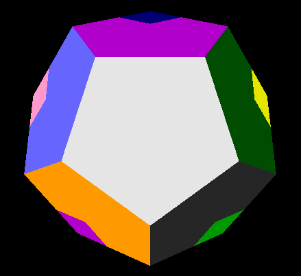

# MEGAMINX
(=version of rubics cube with 12 sides aka Dodekaeder)

internal logic can solve the megamix and animate it

You need to install Python3 to use this.
This project depends on PyOpenGL and pygame.
If using the run.sh (Linux) the dependencies should be installed automatically (venv)
The same goes for the run.bat (Windows) (this one was generated from the run.sh and not tested)

Instruction on how to use the Program:
    1-9,0,E,Z: move the side with index
    hold shift: move the other way around
    V: undo last move
    M: scramble
    hold B: skip animations(useful for scrambling)
    N: Solve the Megaminx (starts form the white side and does it like a human)

rendering is not particularly efficient:
primitives drawn one by one, by individual API-calls (no VBO).
this is mostly because my understanding of OpenGL rendering
was limited back then...
However the program is still very usable
